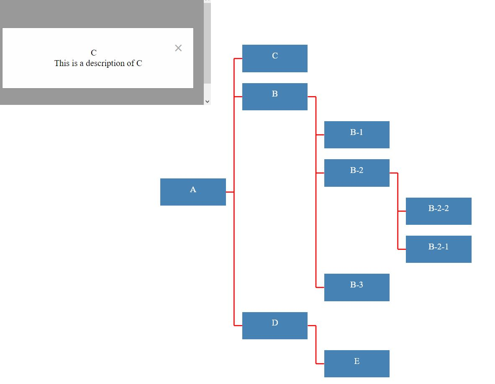

# Graph visualizer

Display a graph based on received data from a third party service.  
The graph is displaying its nodes in a way that is easy to visually determine descendants.

### How to

##### Run the server

- Create an `.env` file

```bash
cd server && touch .env
echo "PORT=4000" > .env

```

- Install dependencies

```bash
npm i
```

- Run the server

```bash
npm start
```

##### Run the client

- Start a local file server, serving files inside the client folder

```bash
# if not previously installed, execute `npm i -g nodemon` && `npm i -g http-server`
cd client && npx nodemon --exec 'http-server'
```

- Open `http://localhost:8080/test.html in a browser

##### Run client tests

```bash
cd client && npm i && npx jest .test

```

### References


